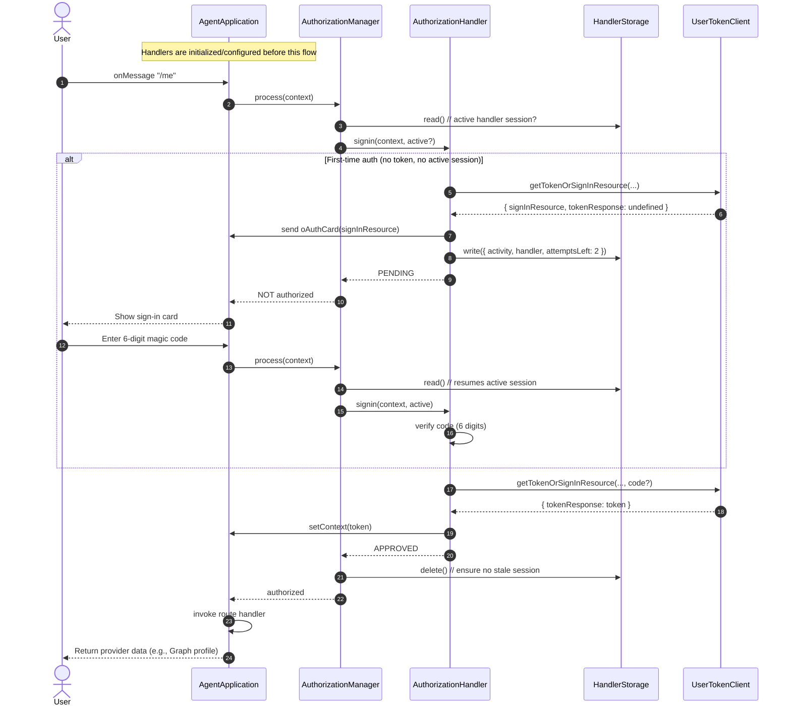

# Sequence Diagram

This diagram shows the normal authorization route flow: app initializes routing, applies an AuthorizationHandler, shows an OAuth card and handles the magic code on first access, then proceeds directly on subsequent signed-in turns; the route handler runs only when authorized.

### Editing tool
[https://www.mermaidchart.com/app/dashboard](https://www.mermaidchart.com/app/dashboard)

### Image

### Code
